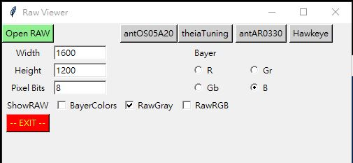
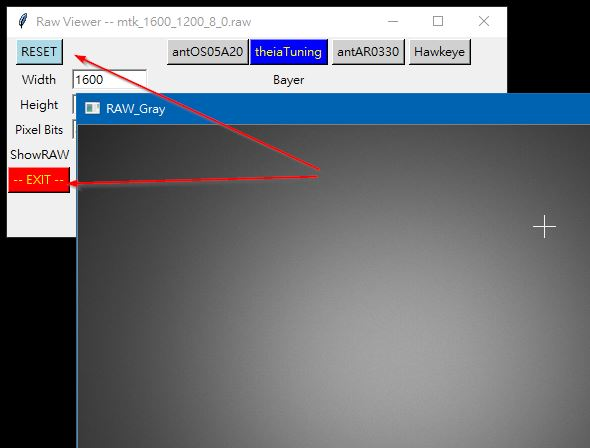
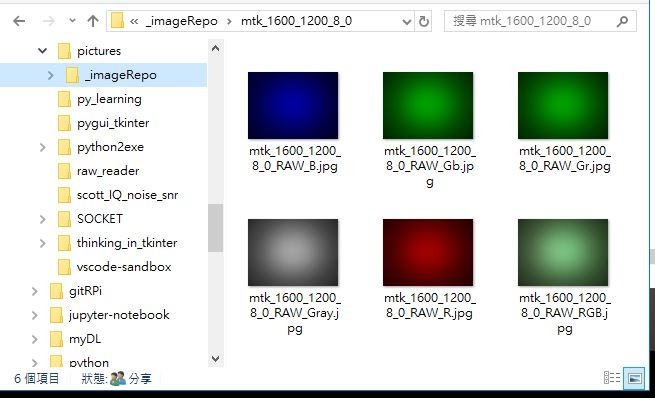
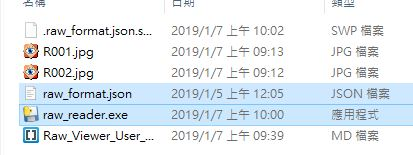

# User's Manual of RAW Viewer #

## Operation ##

1. Confiure format of target RAW image
    

2. Select and Open the target RAW image
    * Click **OpenRAW** button to select target RAW image.
    * 
    * 
    * 

3. Click **RESET** button to dismiss current image, or **Exit** to exit RAW Viewer.
    * After **RESET**, user can select and open next RAW image as Step 1 ~ 3.
    * 

## Saving converted images ##
No matter what display options are selected, RAW Viewer will convert RAW image and save the converted images automatically. The saved images include: RawGray, RawRGB, and four bayer colors (R/Gr/Gb/B) and will be collected in a sub-folder (_imageRepo) under the work directory of the RAW image.

## Quick Config Buttons ##
There are four buttons at the top right corner which are provided to configure known project RAW format including width, height, bits per pixel, and starting bayer color.

The user can customize the preset format of each button via a JSON-formatted configuration file. While Raw View starts, it will look at the configuration file, **raw_format.json**, in the working directory.

## Customizing your Quick Config buttons ##

